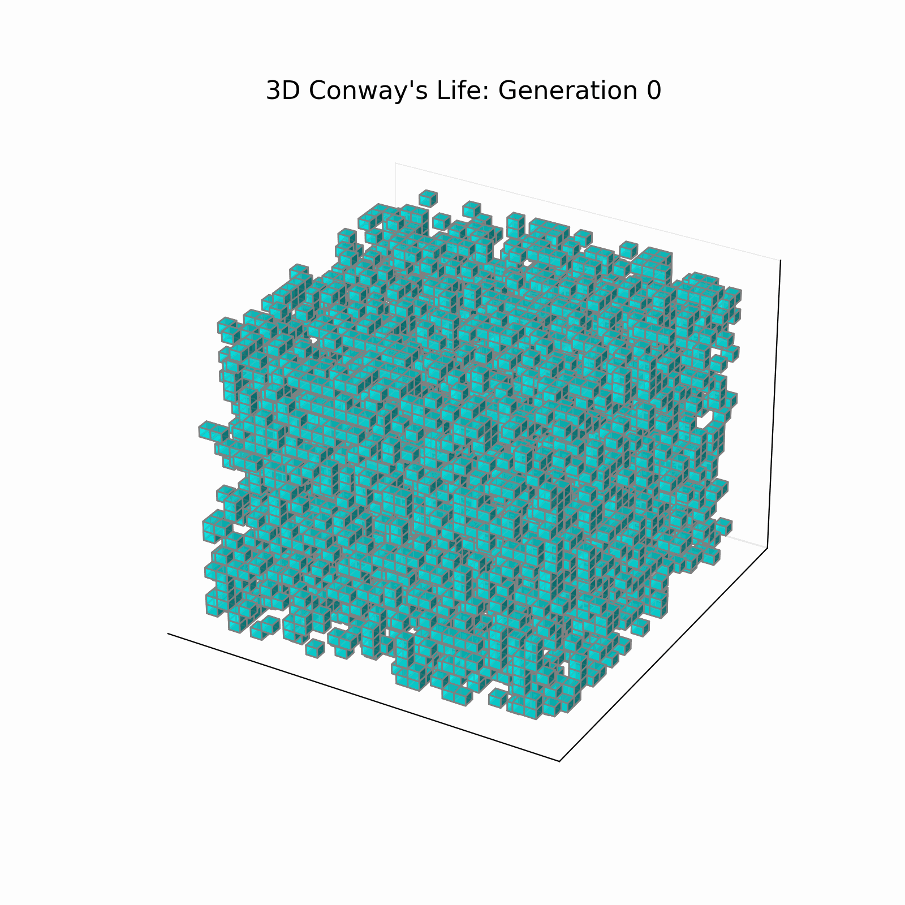

# Documentation

## Description

This repo provides series methods of template class of multi-dimensional `array`,
including printing function for easily viewing values
(see the details in
<a href="https://liyihai-official.github.io/MPI-Algorithms/classmulti__array_1_1array.html">
multi_array::array< T, NumD > Class Template Reference
</a>.
)

See the full docs on:
<a href="https://liyihai-official.github.io/MPI-Algorithms/">
documentation
</a>.

\image html figure/conways_game.gif width=400cm
\image html figure/conways_3d.gif width=400cm
